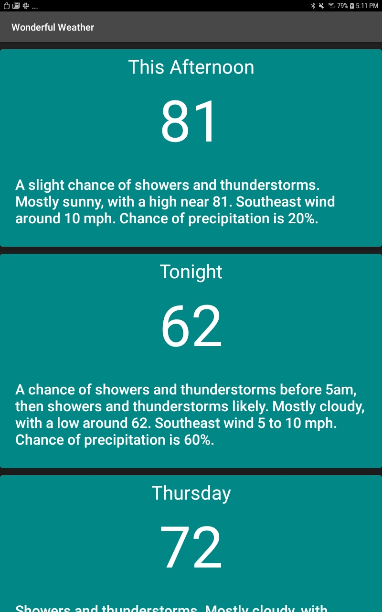

# Wonderful Weather
------------------

An android application built in kotlin to grab weather from an [api](http://api.weather.gov/gridpoints/TOP/31,80/forecast) and display the data in a scrollable list.

## Technologies
----------------
This app uses weather.gov for weather data, runs on kotlin and android, and utilizes google material design libraries along with RecyclerView to beautifuly display the next 10 days forecasts.

## Personal Thoughts
---------------
Before getting started on this app, I had zero experience with kotlin or android devolopment. I used the google android devolopers course as a crash course for kotlin devolopment. This application was made in 6 hours and the kotlin courses took me a week.

Coming from javascript I struggled with using the retrofit library to grab and parse json data. There are many more steps required to reach the desired outcome but building this app has taught me how to reach that outcome using kotlin.

Since I had no experience with android devolopment, this app also allowed me to familiarize myself with android studio and the tools that come with. Creating layouts through xml and the design editor is almost second nature now.

My javascript background helped me a lot with this project. Whenever I was first learning javascript basic programming logic and ways of thinking were new to me, but while learning kotlin I could apply my javascript knowledge and focus on the differences in the ways the two languages operate. This resulted in me being able to identify and understand the ins and outs of android devolopment. 
